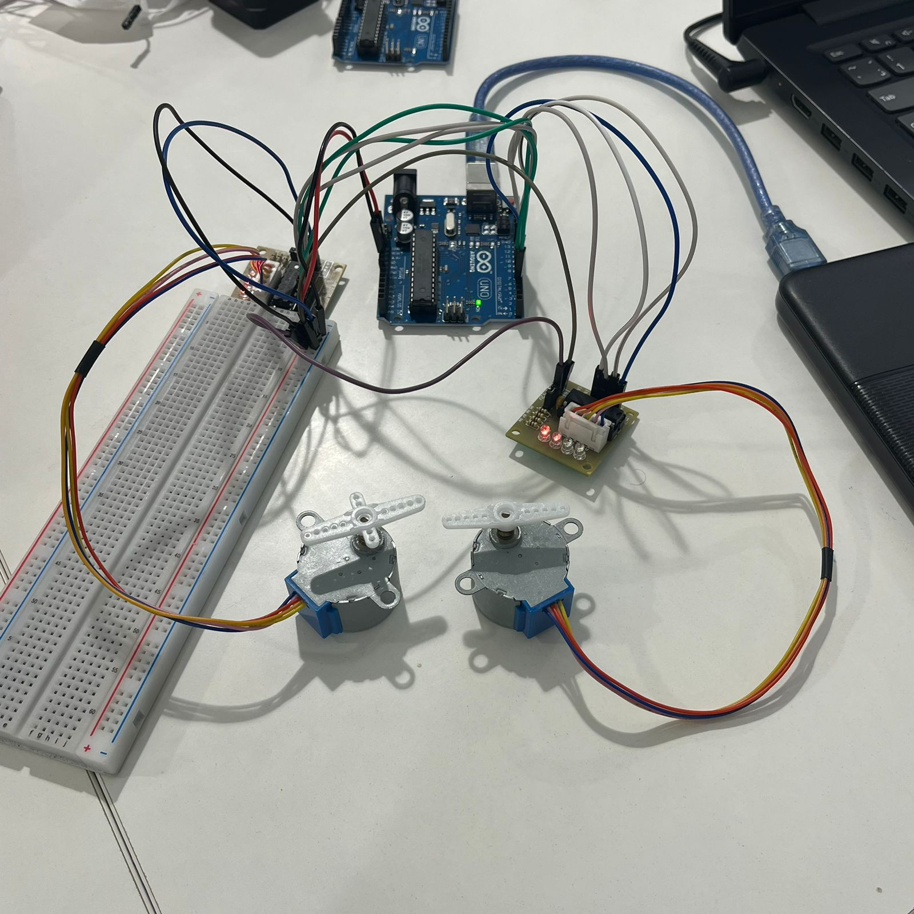

# Dual Stepper Motor Control using Arduino

## Project Overview

This project demonstrates how to control **two stepper motors** using an Arduino and a motor driver (ULN2003 / L298N conceptually), with the help of the **AccelStepper library**.

The motors perform continuous back-and-forth motion, simulating directional movement such as:

* Forward
* Backward
* Alternating directions

---

## Components Used

* Arduino Uno
* 2x Stepper Motors (28BYJ-48)
* Motor Driver Module (ULN2003 / equivalent)
* Breadboard
* Jumper Wires
* External Power Supply (recommended)

---

## Circuit Connection

Each motor is connected to 4 digital pins on the Arduino

---

## How It Works

* The project uses the **AccelStepper library** to control speed and acceleration.
* Each motor is assigned:

  * Speed
  * Acceleration
  * Target position
* When the motor reaches its position, it reverses direction automatically.

---

## Code

```cpp
#include <AccelStepper.h>

#define FULLSTEP 4
#define HALFSTEP 8

#define motorPin1 8
#define motorPin2 9
#define motorPin3 10
#define motorPin4 11

#define motorPin5 4
#define motorPin6 5
#define motorPin7 6
#define motorPin8 7

AccelStepper stepper1(HALFSTEP , motorPin1 , motorPin3 , motorPin2 , motorPin4);
AccelStepper stepper2(FULLSTEP , motorPin5 , motorPin7 , motorPin6 , motorPin8);

void setup()
{
  stepper1.setMaxSpeed(1000.0);
  stepper1.setAcceleration(50.0);
  stepper1.setSpeed(1000);
  stepper1.moveTo(2048);

  stepper2.setMaxSpeed(2000.0);
  stepper2.setAcceleration(50.0);
  stepper2.setSpeed(200);
  stepper2.moveTo(-2048);
}

void loop()
{
  if (stepper1.distanceToGo() == 0)
    stepper1.moveTo(-stepper1.currentPosition());

  if (stepper2.distanceToGo() == 0)
    stepper2.moveTo(-stepper2.currentPosition());

  stepper1.run();
  stepper2.run();
}
```

---

## Movement Behavior

* Motor 1 rotates forward then backward continuously
* Motor 2 rotates in the opposite direction
* Both motors move smoothly using acceleration control

---

## Project Setup

```

```

---

## Notes

* External power is recommended for stable motor performance
* Ensure correct wiring to avoid motor vibration without rotation


